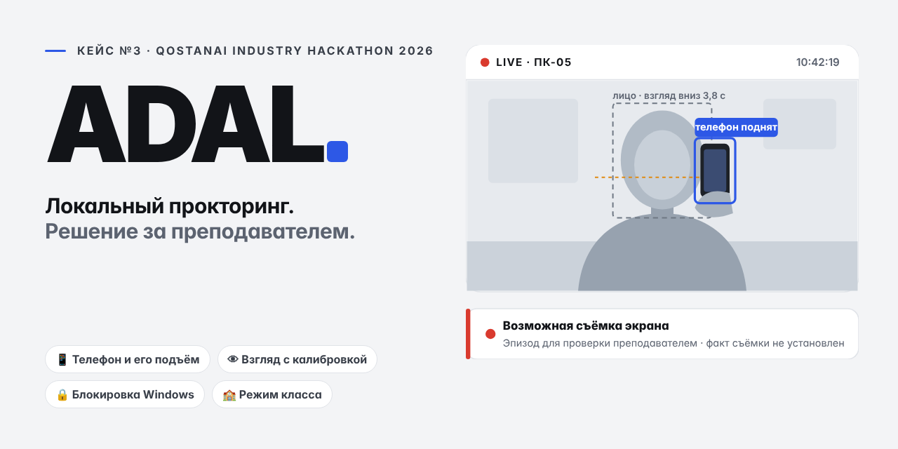
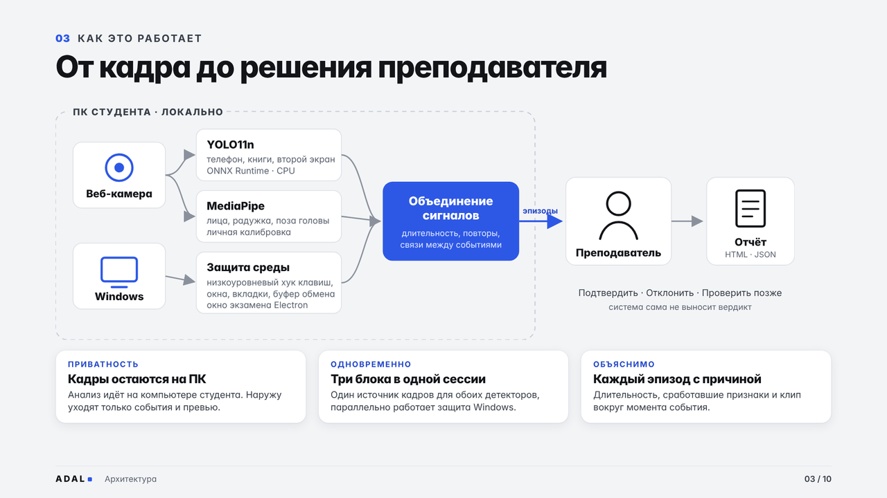
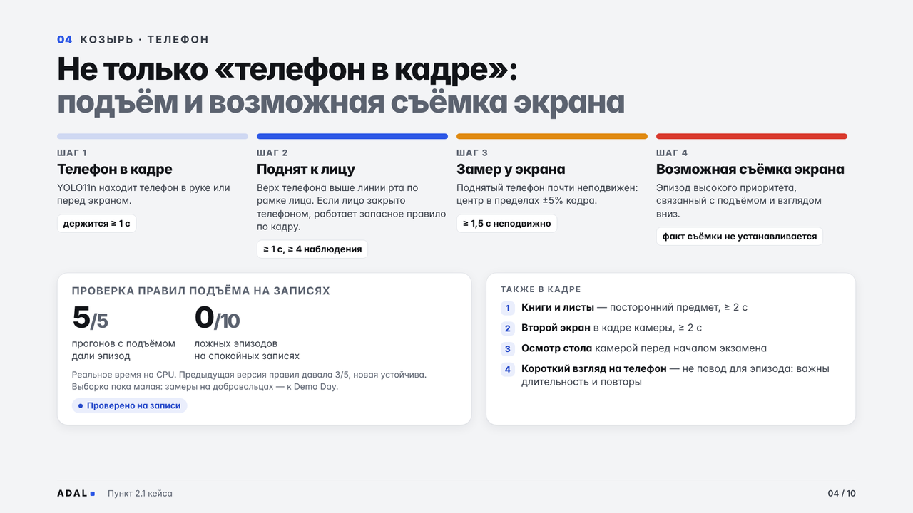
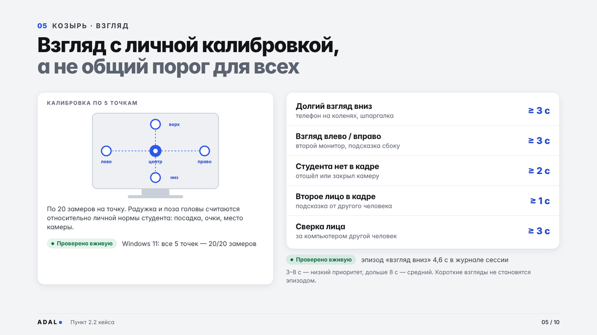
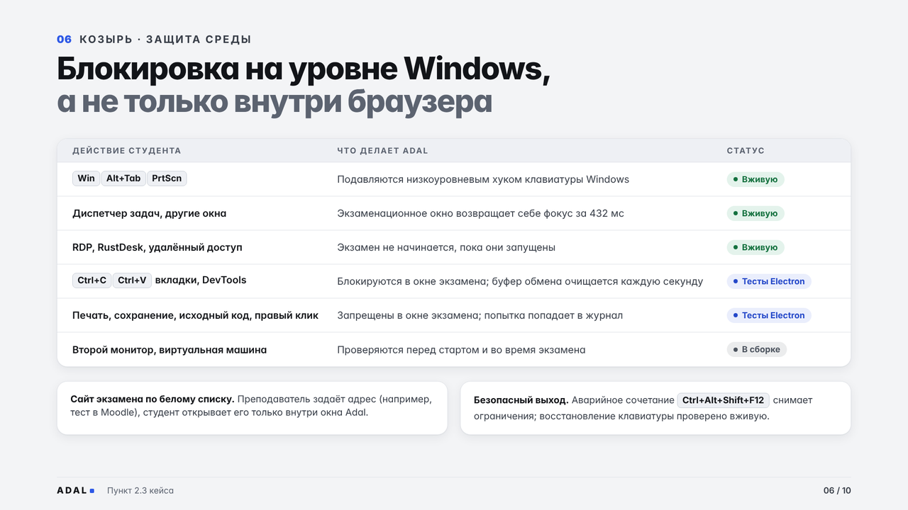
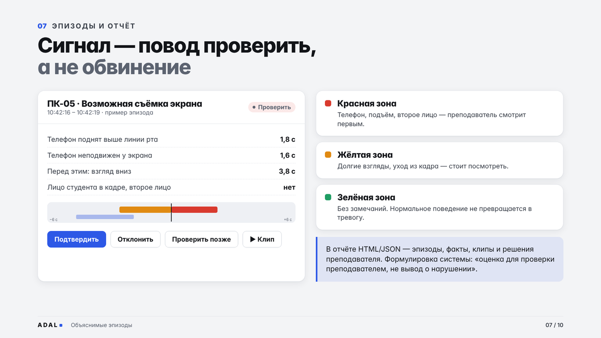
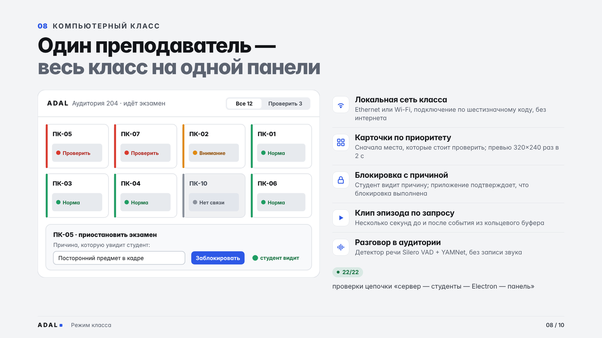

<p align="center">
  
</p>

<p align="center">
  
  
  
  
  
  
  
</p>

# Adal

**Локальный прокторинг для компьютерного класса.** Студент проходит экзамен на своём ПК, преподаватель видит события и проверяет подозрительные эпизоды.

**[Открыть презентацию ↗](https://diiaanns07-droid.github.io/Qostanay_hub/)** · [Презентация PDF](presentation/Adal_Presentation.pdf) · [Техническое описание PDF](presentation/Adal_Description.pdf) · [Запуск на Windows](proctoring/README.md) · [Сценарий демо](proctoring/docs/submission/ADAL_DEMO.md) · [Проверки и ограничения](docs/STATUS.md)

## Что делает Adal

| Блок | Возможности |
| --- | --- |
| Телефон | YOLO11n, отслеживание телефона и его подъёма; временные признаки возможного наведения на экран |
| Лицо и внимание | MediaPipe, калибровка, длительный взгляд вниз/в сторону, отсутствие человека и второе лицо |
| Экзаменационная среда | Разрешённые адреса в окне экзамена, ограничения копирования, печати, сохранения, исходного кода и контекстного меню; Windows helper для системных клавиш |
| Преподаватель | Класс по Ethernet/Wi-Fi, события и зоны внимания, клипы, блокировка с причиной и подтверждением, видимое студенту управление проверкой микрофона |

Экзамен может находиться на отдельном сайте. Анализ камеры выполняется локально на ПК студента. Сигнал системы требует проверки человеком и сам по себе не доказывает списывание.

Дополнительно подключены осмотр стола, сверка лица с началом сессии, анализ речи Silero/YAMNet, предупреждение о виртуальной машине и инструмент подготовки офлайн-комплекта. Для дополнительных моделей нужна отдельная подготовка.

**Статус: интегрированный прототип для пилота.** Работа приложения и управления классом проверяется автоматическими тестами; живую точность CV, блокировку Windows и совместную работу на нескольких физических ПК проверяют отдельно. [Подробный статус](docs/STATUS.md).

## Как это работает

<table>
<tr>
<td width="50%"><br><sub><b>От кадра до решения.</b> Анализ идёт на ПК студента, наружу уходят только события.</sub></td>
<td width="50%"><br><sub><b>Телефон.</b> В кадре → поднят к лицу → неподвижен у экрана → возможная съёмка.</sub></td>
</tr>
<tr>
<td><br><sub><b>Взгляд.</b> Личная калибровка по 5 точкам; вниз и в стороны — отдельные события.</sub></td>
<td><br><sub><b>Среда.</b> Win, Alt+Tab и PrtScn подавляются на уровне Windows.</sub></td>
</tr>
<tr>
<td><br><sub><b>Эпизоды.</b> Сигнал — повод проверить; решение принимает преподаватель.</sub></td>
<td><br><sub><b>Класс.</b> Весь класс на одной панели, блокировка с видимой причиной.</sub></td>
</tr>
</table>

<sub>Иллюстрации — слайды презентации, сцены на них синтетические. Поведение приложения показывает сценарий демонстрации.</sub>

## Запустить на одном ноутбуке

Нужны Windows, Git, **Python 3.12 x64**, **uv**, **Node.js ≥22.12** и npm. Подготовка скачивает зависимости и модели, поэтому выполняется с интернетом заранее.

```powershell
git clone --branch main https://github.com/diiaanns07-droid/Qostanay_hub.git Adal
cd Adal\proctoring
.\packaging\prepare-windows.ps1 -FetchModels
.\Start-Adal.ps1 -Role Standalone -Enforce -CheckOnly
.\Start-Adal.ps1 -Role Standalone -Enforce -DemoOperator
```

Выберите **LIVE**, пройдите согласие, проверку оборудования и калибровку. **SYNTHETIC** — сценарные данные для демонстрации, не реальная камера. `-CheckOnly` проверяет подготовку файлов, но не включает устройства или ограничения Windows. `-DemoOperator` выдаёт одноразовый PIN для репетиции; не показывайте его в видео.

**Аварийное снятие ограничений: Ctrl+Alt+Shift+F12.** Перед показом проверьте его на целевом ПК. [Остановка и восстановление](proctoring/README.md#остановка-и-восстановление).

## Запустить класс

1. На ПК преподавателя подготовьте backend и запустите `Start-Adal.ps1 -Role Teacher -Lan -Port 8765`.
2. На этом же ПК откройте `http://127.0.0.1:8765/`, войдите по PIN из консоли и создайте класс.
3. Студентам передайте LAN-адрес сервера и код класса. На каждом студенческом ПК запустите роль `Student` с этим адресом и кодом.

[Полные команды для преподавателя и студентов](proctoring/README.md). Ethernet и Wi-Fi работают через общую локальную сеть. Панель преподавателя доступна на ПК сервера; выбранный TCP-порт должен быть разрешён для подключений студентов.

## Материалы для хакатона

- [Интерактивная презентация](https://diiaanns07-droid.github.io/Qostanay_hub/) — открывается сразу в браузере. [HTML для скачивания](presentation/adal/index.html). Интерактивные сцены используют синтетические данные.
- [Сценарий демонстрации и соответствие ТЗ](proctoring/docs/submission/ADAL_DEMO.md).
- [Текст кейса на казахском](docs/case/CASE_SOURCE_KK.txt) и [происхождение исходного PDF](docs/case/CASE_PROVENANCE.json).
- [Проверки объединённой версии](docs/STATUS.md), включая границы доказательств.

## Команда AltF4

Кейс №3 «Локальный прокторинг — защита браузера, контроль взгляда и детекция смартфонов (Proctoring CV + Security)», организаторы кейса — КРУ им. А. Байтұрсынұлы и Qostanai Hub.

| Участник | |
| --- | --- |
| Қарабек Дамир | капитан |
| Арысбай Диас | |
| Жорабек Бекзат | |
| Сарсенбаева Айдана | |
| Махсут Гүлнур | |

## ИИ-инструменты разработки

Код создан с помощью **Claude Code** и **OpenAI Codex** по модулям, с тестами и протоколами проверки (п. 6.4 Положения). Команда понимает код и объясняет решения сама. Сам продукт облачные API и LLM не использует: анализ выполняется локально на ПК студента.

## Где искать код

| Путь | Назначение |
| --- | --- |
| [`proctoring/backend/`](proctoring/backend/) | Камера, CV, правила событий, запись и API студента |
| [`proctoring/desktop/`](proctoring/desktop/) | Electron, интерфейс студента, окно экзамена и Windows helper |
| [`proctoring/classroom/`](proctoring/classroom/) | Сервер класса; [`class-panel/`](proctoring/class-panel/) — панель преподавателя |
| [`proctoring/contracts/`](proctoring/contracts/) | Общие типы данных и схемы |
| [`proctoring/acceptance/`](proctoring/acceptance/) и [`qa/`](proctoring/qa/) | Интеграционные проверки, тесты и результаты |
| [`presentation/`](presentation/) | Презентация Adal |

Технические протоколы и доказательства разработки сохранены рядом с модулями. Старые задания агентам, дубли презентаций и ранние материалы подачи доступны в истории Git.

Презентация автоматически публикуется из `presentation/adal/` после изменений в `main`. [Статус публикации](https://github.com/diiaanns07-droid/Qostanay_hub/actions/workflows/presentation.yml).

Название продукта — **Adal**. Идентификаторы протоколов `qorgau.*` сохранены для совместимости. Модели, записи, PIN, токены и локальные настройки в Git не добавляются.
